# Smart Irrigation Scheduler & Water Saver - System Architecture

## 🏗️ high-Level Architecture Diagram

```mermaid
graph TD
    %% Define Subsystems
    subgraph Environment ["1. Environment Layer"]
        Soil["🌱 Soil / Crops"]
        Weather["☁️ Weather Conditions"]
    end

    subgraph Edge ["2. Perception & 3. Edge Control (ESP32)"]
        Sensor["📡 Moisture Sensor (YL-69)"]
        LCD["🖥️ LCD Display"]
        EdgeLogic["⚡ Edge Control Logic<br/>(Auto-Calibration & Safety)"]
        Relay["🔌 Relay Module"]
        Pump["🌊 Water Pump"]
    end

    subgraph Cloud ["4. Comm & 5. Cloud Storage (ThingsBoard)"]
        TB_Telemetry[("💾 Telemetry Storage<br/>(Time-Series Data)")]
        TB_RPC["🔄 Command/Attributes"]
    end

    subgraph Agent ["6. Memory & 7. Reasoning (AI Agent)"]
        Context["🧠 Memory & Context<br/>(Crop Stage, History)"]
        Planner["⚙️ Decision Engine<br/>(ET0 Calculation & Planning)"]
        WeatherAPI["🌍 OpenWeather API"]
    end

    subgraph UI ["8. User Interface (Streamlit)"]
        Dash["📊 Interactive Dashboard<br/>(Monitor, Control, Alerts)"]
    end

    %% Data Flow
    Soil -->|Moisture Data| Sensor
    Sensor --> EdgeLogic
    EdgeLogic -->|Real-Time Values| LCD
    
    %% Telemetry Upload
    EdgeLogic -->|HTTP/MQTT: Telemetry| TB_Telemetry
    
    %% AI Decision Loop
    TB_Telemetry -->|Fetch Live Data| Planner
    Weather -->|Forecast| WeatherAPI
    WeatherAPI -->|Rain Probability| Planner
    Context -->|Growth Stage / Kc| Planner
    
    %% Decision Execution
    Planner -->|Smart Decision| TB_RPC
    TB_RPC -->|Poll Command| EdgeLogic
    EdgeLogic -->|Actuate| Relay
    Relay -->|Power| Pump
    Pump -->|Water| Soil

    %% UI Interaction
    TB_Telemetry -->|Visualize| Dash
    Dash -->|User Config / Override| TB_RPC
    
    %% Feedback
    Planner -.->|Feedback Loop| Context

    %% Styles
    classDef env fill:#e8f5e9,stroke:#2e7d32,stroke-width:2px;
    classDef edge fill:#fff3e0,stroke:#ef6c00,stroke-width:2px;
    classDef cloud fill:#e3f2fd,stroke:#1565c0,stroke-width:2px;
    classDef agent fill:#f3e5f5,stroke:#7b1fa2,stroke-width:2px;
    classDef ui fill:#fffde7,stroke:#fbc02d,stroke-width:2px;

    class Soil,Weather env;
    class Sensor,LCD,EdgeLogic,Relay,Pump edge;
    class TB_Telemetry,TB_RPC cloud;
    class Context,Planner,WeatherAPI agent;
    class Dash ui;
```

## 🧠 Agentic AI Properties

The system is designed not just as a remote control, but as an **Agentic AI** that acts autonomously to optimize outcomes. Here is how it demonstrates core agentic properties:

### 1. Perception (Sensing)
The system "perceives" its environment through:
*   **Internal Sensors**: The ESP32 continuously polls the **YL-69** resistive sensor to understand the current soil moisture state.
*   **External Intelligence**: It extends its perception beyond the field by querying **OpenWeatherMap** APIs to "see" approaching rain or heatwaves.

### 2. Memory (Context)
Unlike simple reactive systems, this agent maintains context:
*   **Short-term**: Remembers the current state of the pump and immediate sensor fluctuations (smoothing).
*   **Long-term**: Uses **ThingsBoard** to store historical trends. It "knows" if it irrigated yesterday or if the soil is drying out faster than usual.
*   **Semantic Memory**: Stores knowledge about **Crop Types** (Rice vs Wheat) and **Growth Stages** (Vegetative vs Ripening) to adjust its behavior dynamically.

### 3. Reasoning (Decision Logic)
The core intelligence (`decision_core.py`) uses a fusion of data to reason:
*   **Equation**: `Net Demand = (ET0 * Kc) - (Current Moisture + Rain Forecast)`
*   **Logic**:
    *   *If* soil is dry *BUT* rain is >60% likely ➡️ **SKIP** (Save Water).
    *   *If* soil is moist *BUT* crop is in critical flowering stage ➡️ **TOP-UP** (Ensure Health).
    *   *If* user overrides ➡️ **COMPLY** (Human-in-the-loop priority).

### 4. Planning (Scheduling)
The agent doesn't just react; it plans:
*   It calculates the **precise volume** of water needed (in Liters/Ha).
*   It converts this volume into a **time duration** for the pump.
*   It schedules the irrigation event, ensuring it doesn't over-water (using auto-calibration limits).

### 5. Action (Actuation)
The "mind" (Python Agent) controls the "body" (ESP32) via the cloud:
*   The Agent pushes a command (e.g., `PUMP_ON` for 300s).
*   The **ESP32 Edge Layer** forces the physical relay to switch.
*   The water pump activates, physically altering the environment (Environment Layer).

### 6. Feedback (Learning Loop)
*   **Immediate Feedback**: The dashboard visualizes the "Water Saved" metric (comparing intelligent usage vs. a standard fixed schedule).
*   **Systemic Feedback**: As the soil moisture rises after irrigation, the sensors detect the change, verifying the action was successful and completing the loop.

---

## 🎯 Project Objectives

### Primary Objectives
*   ✅ **Monitor** soil moisture in real-time (ESP32 + YL-69).
*   ✅ **Control** irrigation automatically via Relay & Pump.
*   ✅ **Adapt** to soil types using Auto-Calibration (Values 0-4095 mapped to 0-100%).
*   ✅ **Reduce** water wastage by enforcing precise thresholds.

### Agentic AI Objectives
*   ✅ **Autonomous Operation**: Senses -> Decides -> Acts without constant human input.
*   ✅ **Context Awareness**: Integrates Crop Stage & Weather Forecast into decisions.
*   ✅ **Hybrid Memory**: Combines Edge (Flash) and Cloud (ThingsBoard) storage.
*   ✅ **Impact Analysis**: Calculates and displays water savings dynamically.

### Cloud & UI Objectives
*   ✅ **Secure Storage**: All telemetry is time-stamped and stored in ThingsBoard.
*   ✅ **Live Visualization**: Streamlit Dashboard provides a "Mission Control" view.
*   ✅ **Alerts**: Instant user feedback on Rain Delays or Dry Soil events.

### Sustainability Objective
*   🌱 **Sustainable Farming**: By using only exactly what the crop needs (ET0-based), we significantly reduce the water footprint of agricultural plots.
